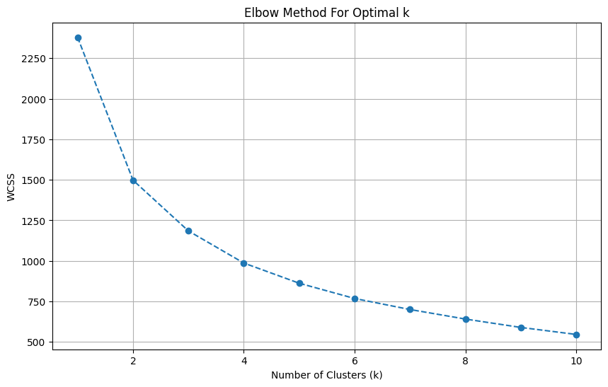

# Customer-Segmentation-Project
A customer segmentation project using RFM analysis and K-Means clustering on Superstore sales data.
# Customer Segmentation using RFM Analysis and K-Means Clustering

## Project Overview

This project aims to segment a customer base using the RFM (Recency, Frequency, Monetary) analysis model and K-Means clustering. By identifying distinct customer groups, businesses can tailor marketing strategies to improve customer engagement, retention, and overall profitability.

## Dataset

The dataset used is `sample_superstore.csv`, containing transactional data for a retail superstore. Key columns include `Order Date`, `Customer ID`, `Sales`, `Quantity`, and `Profit`.

## Methodology

1.  **Data Loading & Preprocessing:** Loaded the `sample_superstore.csv` dataset and performed initial data inspection, type conversions, and handling of missing values.
2.  **RFM Feature Engineering:** Calculated Recency, Frequency, and Monetary values for each customer.
    *   **Recency:** Days since the last purchase.
    *   **Frequency:** Total number of unique purchases.
    *   **Monetary:** Total sales value.
3.  **Data Preprocessing for Clustering:** Applied log transformation to RFM features to reduce skewness and used `StandardScaler` for feature scaling.
4.  **K-Means Clustering:** Used the Elbow Method to determine the optimal number of clusters (which was found to be 4) and applied K-Means to segment customers.
5.  **Customer Segment Analysis:** Analyzed the mean RFM values for each cluster to understand their characteristics and define their business profiles.

## Key Findings & Customer Segments

Based on the K-Means clustering with `k=4`, the following customer segments were identified:

### Cluster 0: High-Value, Frequent, and Recent Customers (Best Customers)

*   **Recency:** ~88 days (relatively recent)
*   **Frequency:** ~8.5 purchases (highest)
*   **Monetary:** ~$4928 (highest)
*   **Description:** These are the most valuable customers. They buy frequently, spend the most, and have made a purchase recently. Focus on retention, loyalty programs, and premium offerings.

### Cluster 1: Loyal but Less Recent Customers (At-Risk of Churning)

*   **Recency:** ~225 days (less recent)
*   **Frequency:** ~5.1 purchases (moderate)
*   **Monetary:** ~$1969 (moderate)
*   **Description:** Formerly valuable customers who haven't purchased as recently. Strategies should focus on re-engagement with personalized offers or win-back campaigns.

### Cluster 2: Recent and Moderate Spenders (New/Recently Active, High Potential)

*   **Recency:** ~17 days (most recent)
*   **Frequency:** ~6.8 purchases (moderate)
*   **Monetary:** ~$2532 (moderate)
*   **Description:** New or recently active customers with decent spending. High potential to become high-value customers. Focus on onboarding, product recommendations, and incentives for repeat purchases.

### Cluster 3: Lapsed or Low-Value Customers

*   **Recency:** ~340 days (least recent)
*   **Frequency:** ~2.5 purchases (lowest)
*   **Monetary:** ~$480 (lowest)
*   **Description:** Customers who haven't purchased for a long time, buy infrequently, and spend the least. Re-engagement efforts might be less effective; consider targeted clearance or focus on other segments.

## Visualizations

### Elbow Method for Optimal k

_This plot helps determine the optimal number of clusters by showing the Within-Cluster Sum of Squares (WCSS) for different k values._

### Mean RFM Values by Cluster

_Bar plots illustrating the average Recency, Frequency, and Monetary values for each customer segment._

### Distribution of Customers Across Clusters

_A bar chart showing the number of customers in each of the identified clusters._

### Distribution of Monetary Value Across Clusters

_Box plot visualizing the spread of monetary values within each customer segment._

## Conclusion

This RFM analysis and K-Means clustering project provides actionable insights for targeted marketing strategies, allowing the business to optimize marketing spend, improve customer retention, and enhance Customer Lifetime Value (CLTV).
